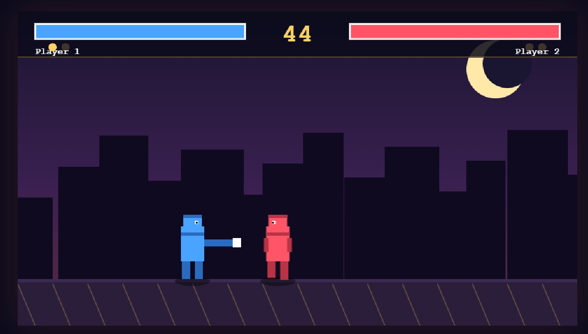

# Pixel-Fighters

A retro 2D fighting game built with HTML Canvas and vanilla JavaScript. Two fighters, three rounds, one winner. Fight against a friend locally or take on a CPU opponent.

---

## ✨ Features

- 🥊 **1v1 combat** — Player vs CPU or Player vs Player (local)
- ❤️ **Health bars & rounds** — best of 3, first to 2 round wins takes the match
- ⏱️ **60-second round timer** — win by KO or by having more HP when time expires
- 🎯 **Attack system** — light and heavy attacks with startup / active / recovery phases
- 🛡️ **Blocking** — hold back to block incoming attacks (chip damage still applies)
- 🤖 **CPU opponent** — simple state-machine AI that approaches, attacks, retreats, and blocks
- 👊 **Hitstun & knockback** — hits stagger the opponent and push them back
- 💥 **Particle sparks** — visual feedback on every hit and block
- 🔊 **Synthesized sound effects** — pure Web Audio API (no audio files needed)
- 🎨 **Pixel-art rendering** — hand-drawn fighters using `fillRect`
- 🖥️ **Auto-scaling canvas** — fits any screen size
- 🔒 **Local 2-player** — share one keyboard, no networking required

---

## 🎮 Controls

### Player 1 (left fighter)

| Action | Key |
|--------|-----|
| Move Left | `A` |
| Move Right | `D` |
| Jump | `W` |
| Crouch | `S` |
| Light Attack | `F` |
| Heavy Attack | `G` |
| Block | Hold back (away from opponent) |

### Player 2 (right fighter)

| Action | Key |
|--------|-----|
| Move Left | `←` |
| Move Right | `→` |
| Jump | `↑` |
| Crouch | `↓` |
| Light Attack | `K` |
| Heavy Attack | `L` |
| Block | Hold back (away from opponent) |

**CPU mode:** Player 2's keys are ignored — the CPU controls the right fighter automatically.

---

## 🚀 How to Play

1. Clone or download this repo
2. Open `index.html` in any modern browser
3. Click **vs CPU** or **2 Players**
4. Fight! Win 2 out of 3 rounds to take the match

---

## 🛠 Tech Stack

| Technology | Purpose |
|------------|---------|
| HTML5 Canvas | Rendering |
| Vanilla JS (ES6) | Game loop, physics, hit detection, AI |
| Web Audio API | Synthesized sound effects |
| CSS3 | Overlays, HUD, responsive layout |

---

## 🧠 How It Works

- **Game loop** runs on `requestAnimationFrame` with delta-time updates
- **Fighters** are a single `Fighter` class — the only difference between player and CPU is which input object gets fed into `update()`
- **Attacks** have three phases (startup / active / recovery), so heavy attacks are slower but deal more damage
- **Input** is normalized to `{left, right, up, down, light, heavy}` — meaning the CPU "presses buttons" the same way a human does
- **Hit detection** compares the attacker's hitbox against the defender's hurtbox; blocking is determined by whether the defender is holding back
- **CPU AI** is a simple state machine: approach → attack → retreat → wait, with randomness and reactive blocking
- **Rounds** reset positions and health; match ends when someone wins 2 rounds

---

## ⚔️ Combat Details

### Light Attack

| Property | Value |
|----------|-------|
| Startup | 4 frames |
| Active | 3 frames |
| Recovery | 6 frames |
| Damage | 6 |
| Reach | 55px |
| Knockback | 3 |
| Hitstun | 12 frames |

### Heavy Attack

| Property | Value |
|----------|-------|
| Startup | 8 frames |
| Active | 5 frames |
| Recovery | 14 frames |
| Damage | 14 |
| Reach | 70px |
| Knockback | 8 |
| Hitstun | 22 frames |

### Blocking

- Triggered by holding back while grounded, not attacking, and not crouching
- Reduces damage to **15%** (chip damage) and applies 8 frames of blockstun
- Chip damage cannot KO — you're safe at 1 HP while blocking

---

## 🎯 Rules

- **Best of 3 rounds** — first to 2 round wins takes the match
- Each round lasts **60 seconds**
- Win a round by:
  - Reducing opponent's HP to 0 (**K.O.**), or
  - Having more HP when the timer expires (**Time Up**)
- Ties on time-up go to Player 1
  
---

## 🙌 Credits

Built with ❤️ using nothing but HTML, CSS, and JavaScript.
